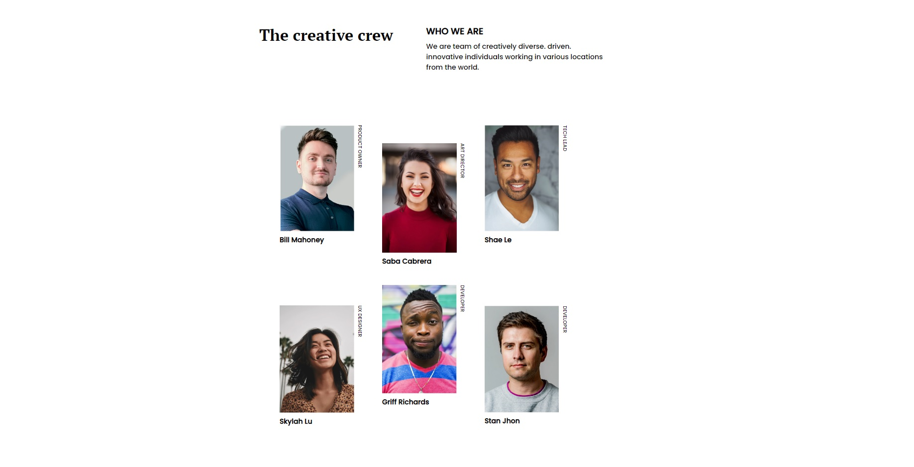
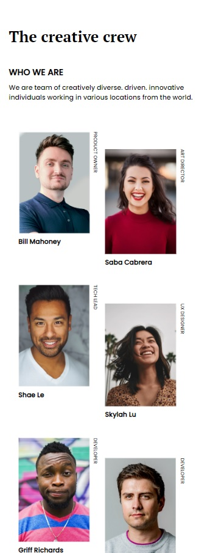

# Make-It-Real---My-Team-Page
MakeItReal - Trabajo06 - Octubre 14 del 2022

## Tabla de contenido

- [Taller](#Taller)
- [Resultado](#Resultado)
- [Recursos](#Recursos)
    - [Caracteristicas](#Caracteristicas)
- [Conclusiones](#Conclusiones)

## Taller
    Realizar un contenedor con la información del equipo de trabajo con sus respectivas imagenes e informacion.

    [Taller07](https://github.com/makeitrealcamp/top-v25/tree/main/challenges/my-team-page)

## Resultado (Desktop & Mobile)

> Desktop

> Mobile

## Recursos

Se realizo con las tecnologias:
    - Html
    - Css

La imagen fue suministrada y las caracteristicas son las siguientes:

### Caracteristicas

    Guia de Estilo:

    - Mobile: 375px
    - Desktop: 1440px

    Colores:

    - White: hsl(0, 0%, 100%)
    - Black: #000000;

    Tipografia:

    - Family: [Poppins](https://fonts.google.com/specimen/Poppins)
    - Family: [PT Serif](https://fonts.google.com/specimen/PT+Serif)
    - Weights: 400 / 700
    - Font size: 10px/14px/15px/18px/ (Respectivamente)

## Conclusiones

En el taller07 se presento un reto aun mayor en el desarrollo de la estructura, en un contenedor donde se visualiza la informacion del equipo podemos observar que su posicionamiento y distribucion cambia respecto a la resolucion de las pantallas, use un display flex y posiciones absolutas/relativas dependiendo del dispositivo con el objetivo de brindar un full responsive.